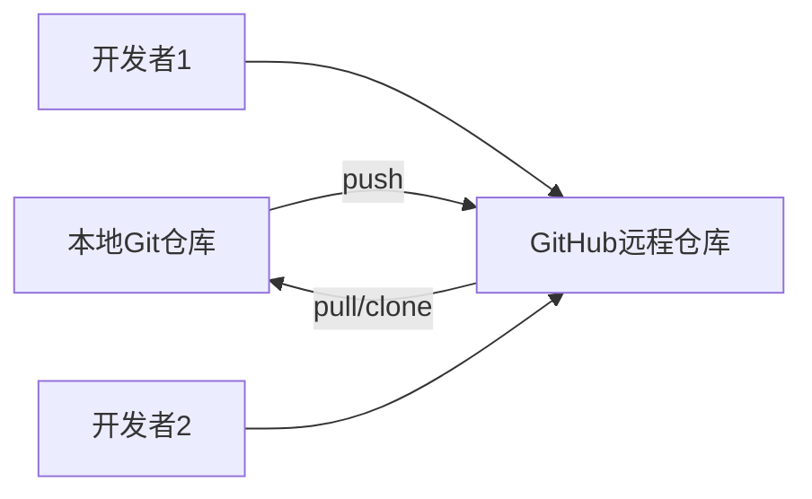

# GitHub 与 Git 的关系及推送指南

## 目录
1. [Git 与 GitHub 的关系](#git-与-github-的关系)
2. [本地项目推送全流程](#本地项目推送全流程)
3. [关键概念详解](#关键概念详解)
4. [常见问题排查](#常见问题排查)

---

## Git 与 GitHub 的关系

### 核心区别
|              | Git          | GitHub              |
| ------------ | ------------ | ------------------- |
| **性质**     | 版本控制软件 | 代码托管平台        |
| **安装需求** | 需本地安装   | 基于网页服务        |
| **核心功能** | 代码版本管理 | 代码托管 + 协作功能 |
| **存储位置** | 本地仓库     | 远程云仓库          |

### 协作关系图解


## 本地项目推送全流程

### 准备工作

1. 在 GitHub 创建新仓库（不要初始化 README）
2. 确保本地已安装 Git Bash

### 操作步骤

#### 步骤1：初始化本地仓库

```bash
# 进入项目目录
cd /path/to/your/project

# 初始化Git仓库
git init
```

#### 步骤2：添加文件到暂存区

```bash
# 添加所有文件
git add .

# 或指定具体文件
git add index.html style.css
```

#### 步骤3：提交更改

```bash
git commit -m "Initial project setup"
```

#### 步骤4：关联远程仓库

```bash
git remote add origin https://github.com/你的用户名/仓库名.git
# 验证关联
git remote -v
```

#### 步骤5：推送代码

```bash
# 首次推送（-u 设置上游分支）
git push -u origin main

# 后续推送
git push
```

### 完整流程示例

```bash
# 新项目初始化示例
mkdir my-project && cd my-project
echo "# My Project" >> README.md
git init
git add README.md
git commit -m "Add README"
git remote add origin https://github.com/user/repo.git
git push -u origin main
```

------

## 关键概念详解

### 1. 远程仓库(Remote)

- **origin**：默认远程仓库别名

- **查看配置**：`git remote -v`

- **修改地址**：

  ```bash
  git remote set-url origin 新地址
  ```

### 2. 分支(Branch)

- **main/master**：默认主分支

- **推送指定分支**：

  ```bash
  git push origin feature-branch
  ```

### 3. 推送冲突处理

当远程有更新而本地未同步时：

```bash
# 先拉取合并
git pull --rebase origin main
# 解决冲突后重新推送
git push
```