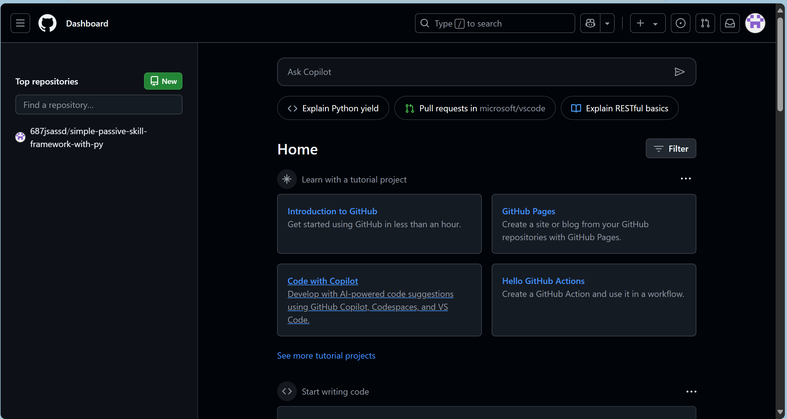
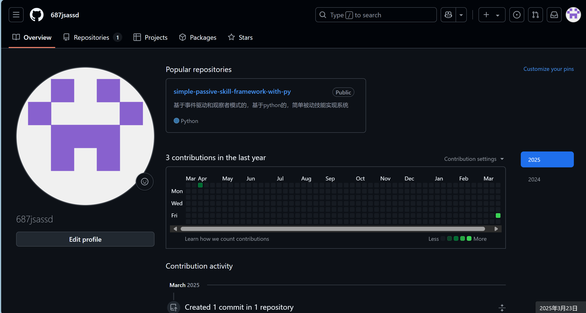

# GitHub 入门学习笔记

## 目录
1. [GitHub 基本界面熟悉](#github-基本界面熟悉)
2. [核心概念解析](#核心概念解析)
   - [Repository](#repository)
   - [Star](#star)
   - [Fork](#fork)
   - [Pull Request](#pull-request)

---

## 基本界面熟悉




1. **顶部导航栏**
   
   - 左侧：搜索栏（快速查找仓库/用户）
   
   - 右侧：通知图标、个人头像（访问个人主页/设置）
   
   - `+` 按钮：创建新仓库/组织/导入代码
   
     
   
   
   
   
   
2. **个人主页**
   
   - Overview：近期活动、收藏的仓库
   
   - Repositories：你创建/参与的仓库列表
   
   - Stars：你收藏的仓库
   
     
   
3. **仓库页面**
   - `Code` 标签：查看代码文件
   - `Issues`：问题讨论区
   - `Pull requests`：合并请求列表
   - `Actions`：自动化工作流
   - `Settings`：仓库配置

---

## 某些概念的解析

### Repository
- **定义**：项目的存储空间，包含代码、文档、版本历史等。
- **关键点**：
  - 每个仓库有唯一 URL（如 `https://github.com/用户名/仓库名`）
  - 支持 `Public`（公开）和 `Private`（私有）
  - 包含 `README.md`（项目说明文件） `注：也可没有，但是推荐是添加的。`

### Star
- **作用**：
  - 标记感兴趣的项目（类似书签）
  - 提高项目曝光度
- **操作**：
  - 点击仓库页面的 ⭐️ 按钮
  - 在个人主页的 `Stars` 标签查看所有收藏

### Fork
- **定义**：复制他人仓库到自己的账号下，独立修改。

- **用途**：
  - 基于原项目二次开发
  - 修改后通过 `Pull Request` 贡献回原项目
  
- **操作**：
  
  ```markdown
  1. 进入目标仓库页面
  2. 点击右上角 `Fork` 按钮
  3. 选择自己的账号作为目标位置
  ```

### Pull-Request

- **作用**：请求将你的代码变更合并到原仓库。
- **典型流程**：
  1. Fork 原仓库
  2. 在本地修改代码并提交到你的 Fork 仓库
  3. 点击原仓库的 `New pull request` 按钮
  4. 选择你的分支并提交说明