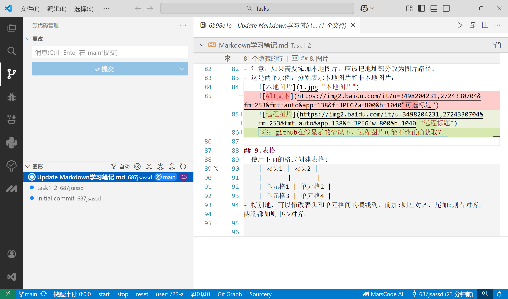

# 手把手在 VSCode 中使用 Git

## 正确配置结果：



## 准备工作
1. 确保已安装：
   - [VSCode](https://code.visualstudio.com/)
   - [Git](https://git-scm.com/)
2. 在终端验证 Git 安装：
   ```bash
   git --version

## 基础配置

### 1. 关联用户信息（全局配置）

```bash
git config --global user.name "你的名字"
git config --global user.email "你的邮箱"
```

### 2. 打开 VSCode 的 Git 面板

- 左侧活动栏点击 **源代码管理** 图标（或按 `Ctrl+Shift+G`）
- 首次使用会提示启用 Git

------

## 基础操作流程

### 1. 初始化仓库

```bash
# 方法1：终端命令
git init

# 方法2：图形化操作
1. 打开文件夹（Ctrl+K Ctrl+O）
2. 在源代码管理面板点击 "初始化仓库"
```

### 2. 克隆现有仓库

```bash
# 方法1：终端命令
git clone https://github.com/username/repo.git

# 方法2：图形化操作
1. 按 F1 打开命令面板
2. 输入 "Git: Clone"
3. 粘贴仓库 URL
```

### 3. 文件追踪与提交

1. 修改/创建文件后，Git 面板会显示更改
2. 点击 `+` 暂存单个文件，或点击 `✓` 旁箭头选择 "暂存所有更改"
3. 输入提交信息，点击 `✓` 提交

### 4. 推送代码到远程

```bash
# 方法1：图形化操作
1. 点击底部状态栏的 "同步更改" 图标（两个箭头环形）
2. 选择 "Push"

# 方法2：终端命令
git push
```

------

## 进阶功能

### 1. 分支管理

- **查看分支**：底部状态栏左侧显示当前分支
- **创建分支**：
  1. 点击状态栏分支名称
  2. 选择 "创建新分支"
- **切换分支**：
  1. 点击状态栏分支名称
  2. 从列表中选择目标分支

### 2. 解决合并冲突

1. 当出现冲突时，文件会显示冲突标记
2. 点击冲突文件，使用内置的合并编辑器：
   - `Accept Current Change` 保留当前更改
   - `Accept Incoming Change` 采用他人更改
   - `Accept Both Changes` 保留双方修改

### 3. 查看历史记录

1. 右键文件选择 "打开时间线视图"
2. 或安装 [GitLens 扩展](https://marketplace.visualstudio.com/items?itemName=eamodio.gitlens) 获得增强历史查看功能

------

## 实用技巧

### 1. 快速访问常用操作

按 `Ctrl+Shift+P` 打开命令面板，输入：

- `Git: Pull` 拉取更新
- `Git: Fetch` 获取远程状态
- `Git: Stash` 储藏修改

### 2. 可视化差异对比

- 点击已修改文件的 `Compare Changes` 图标
- 使用左右分栏对比修改内容

### 3. 忽略文件配置

1. 在项目根目录创建 `.gitignore` 文件

2. 使用语法示例：

   ```bash
   # 忽略所有日志文件
   *.log
   
   # 忽略 node_modules 目录
   node_modules/
   ```

------

## 常见问题解决

### Q1: 找不到 Git 面板？

- 检查是否打开文件夹（不能是单个文件）
- 查看是否禁用 Git 扩展（扩展面板搜索 `@builtin git`）

### Q2: 推送被拒绝？

```bash
# 先拉取远程更新
git pull --rebase
# 解决冲突后再推送
git push
```

### Q3: 误删文件如何恢复？

1. 在源代码管理面板的 "更改" 列表
2. 找到被删除文件，点击撤销图标

> 提示：每天开始工作前先执行 `git pull` 是好习惯！