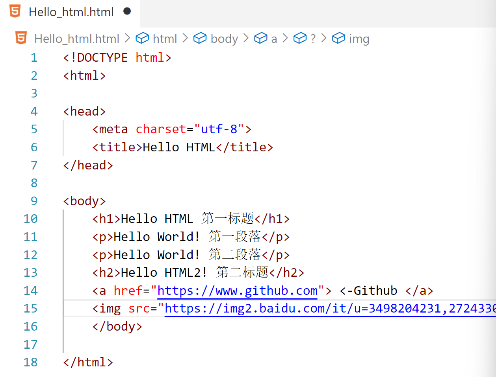

# HTML学习笔记

---

## 什么是 HTML?

HTML 是用来描述网页的一种语言。

- HTML 指的是超文本标记语言: **H**yper**T**ext **M**arkup **L**anguage
- HTML 不是一种编程语言，而是一种**标记**语言
- 标记语言是一套**标记标签** (markup tag)
- HTML 使用标记标签来**描述**网页
- HTML 文档包含了HTML **标签**及**文本**内容
- HTML文档也叫做 **web 页面**

---

## HTML实例格式和常见结构


[HelloHTML](<Hello_html.html>)
- **<!DOCTYPE html>** 声明为 HTML5 文档

  > 不同的HTML类型有不同的声明，正确的声明利于浏览器正确识别和显示。
  >
  > - 其中，HTML5的声明是通用声明。

- **<html>** 元素是 HTML 页面的根元素

- **<head>** 元素包含了文档的元（meta）数据，如 **<meta charset="utf-8">** 定义网页编码格式为 **utf-8**。

  > 为什么要写这一行？
  >
  > - 许多网站都不支持直接显示中文，我们使用这一行改变编码，可以显示中文！

- **<title>** 元素描述了文档的标题

  > 这是在地址栏显示的内容

- **<body>** 元素包含了可见的页面内容

- **<h1>** 元素定义一个大标题

  > 用`<h1>`直到`<h6>`都能定义标题，层级不同。

- **<p>** 元素定义一个段落

- **`<br>`** 元素定义换行

- `<a>`来定义链接

  > 参考格式：`<a href="https://www.github.com">这是指向github的链接</a>`
  >
  > - ***注意*** 不能省略`https://` ，否则会指向服务器中的某页面，而不是外部的链接！！
  > - ***注意*** 在herf属性中添加链接。

- ``来定义图片

  > 参考格式：``
  >
  > - ***注意*** 如果你添加了width和height标签，那么实际图片将按照此尺寸显示，如果你的图片不是这个分辨率，那么会被拉伸或者压缩，**非常难看！！！！！！！！！！！！！**
  > - ***注意*** 在src属性中添加链接，可以是本地，也可以是外链等。


# HTML 元素

------

HTML 文档由 HTML 元素定义。

------

## HTML 元素

| 开始标签 *             | 元素内容     | 结束标签 * |
| :--------------------- | :----------- | :--------- |
| `<p>`                    | 这是一个段落 | `</p>`       |
| `<a href="default.htm">` | 这是一个链接 | `</a>`       |
| `<br>`                  | 换行         |`无`         |

*****开始标签常被称为**起始标签（opening tag）**，结束标签常称为**闭合标签（closing tag）**。

> 有些标签没有结束标签，如换行；有些没有任何内容。下面给出一些知识👇👇👇
>
> ## HTML 空元素
>
> 没有内容的 HTML 元素被称为空元素。空元素是在开始标签中关闭的。
>
> `<br>` 就是没有关闭标签的空元素（`<br>` 标签定义换行）。
>
> 在 XHTML、XML 以及未来版本的 HTML 中，所有元素都必须被关闭。
>
> 在开始标签中添加斜杠，比如 `<br />`，是关闭空元素的正确方法，HTML、XHTML 和 XML 都接受这种方式。
>
> 即使 `<br>` 在所有浏览器中都是有效的，但使用 `<br />` 其实是更长远的保障。
>
> 

- 经过经常忘记这两个标签的我的实测，没有闭合标签</body>和</html>也是可以正常显示的，原因如下：

  > 1. **HTML5的容错设计**：
  >    - HTML5规范明确允许省略某些闭合标签（如`</html>`、`</body>`），浏览器会自动补全缺失的结构。
  >    - 即使未显式声明`<html>`或`<body>`，解析器仍会隐式创建这些元素。
  > 2. **浏览器的纠错机制**：
  >    - 现代浏览器内置了强大的解析器（如WebKit、Blink），能自动修复不规范的HTML结构。
  >    - 遇到未闭合标签时，解析器会根据上下文推断闭合位置，构建正确的DOM树。
  > 3. **标签作用的隐式终止**：
  >    - 当遇到新的块级元素（如`<div>`）或文件结束时，浏览器会主动闭合之前的未闭合标签。
  >    - `</body>`和`</html>`的实际作用在文档流结束时自动终止，因此不影响内容渲染。
  > 4. **标准模式的影响**：
  >    - 正确的`<!DOCTYPE html>`声明触发标准模式，此时浏览器更严格遵循HTML5的容错规则。
  >    - 怪异模式下的处理方式可能不同，但现代开发已普遍采用标准模式。
  >
  > 示例解析过程：
  >
  > ```html
  > <!DOCTYPE html>
  > <title>Test</title>
  > <p>内容
  > ```
  >
  > 浏览器会自动构建为：
  >
  > ```html
  > <html>
  >  <head>
  >   <title>Test</title>
  >  </head>
  >  <body>
  >   <p>内容</p>
  >  </body>
  > </html>
  > ```
  >
  > ***但不要依赖这种做法。忘记使用结束标签会产生不可预料的结果或错误。***

---

## HTML 元素语法

- HTML 元素以**开始标签**起始
- HTML 元素以**结束标签**终止
- **元素的内容**是开始标签与结束标签之间的内容
- 某些 HTML 元素具有**空内容（empty content）**
- 空元素**在开始标签中进行关闭**（以开始标签的结束而结束）
- 大多数 HTML 元素可拥有**属性**

- HTML 标签对大小写不敏感：<P> 等同于 <p>。许多网站都使用大写的 HTML 标签。


# HTML 属性

------

属性是 HTML 元素提供的附加信息。

属性通常出现在 HTML 标签的开始标签中，用于定义元素的行为、样式、内容或其他特性。

属性总是以 **name="value"** 的形式写在标签内，**name** 是属性的名称，**value** 是属性的值。

------

## HTML 属性

- HTML 元素可以设置**属性**
- 属性可以在元素中添加**附加信息**
- 属性一般描述于**开始标签**
- 属性总是以名称/值对的形式出现，**比如：name="value"**。

------

## 属性实例

HTML 链接由 <a> 标签定义。链接的地址在 **href 属性**中指定：

`<a href="http://www.666.com">哇奥！！！</a>`👈这就是一个属性实例😊
